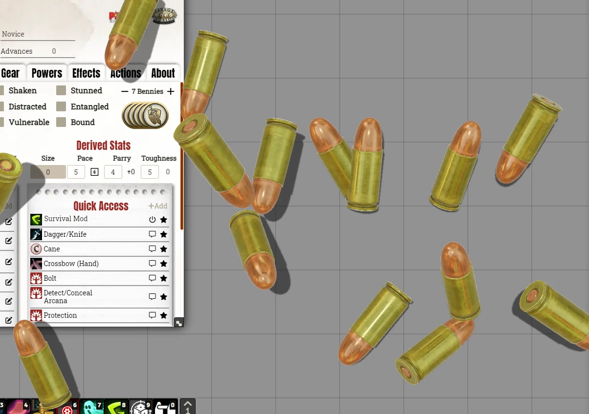
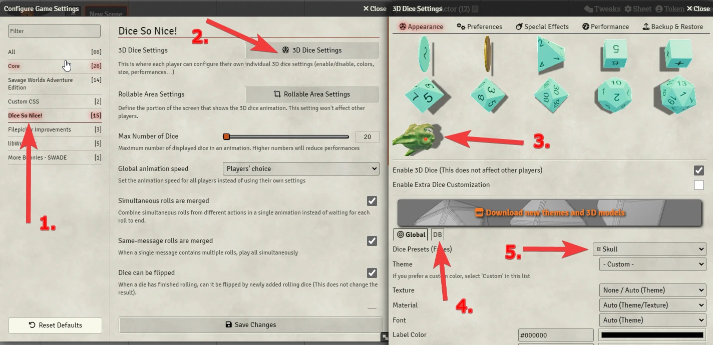
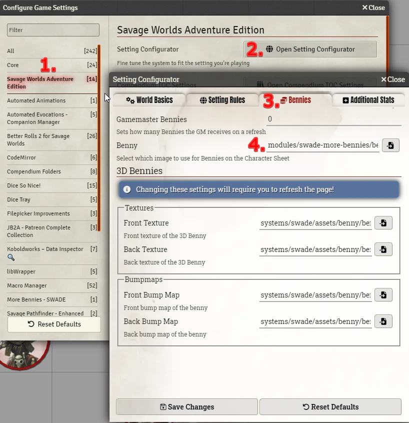

# SWADE - More Bennies
This module add new 2D and 3D bennies models for **SWADE**.

## Bennies
**CLICK THE IMAGE TO WATCH THE VIDEO**

## Features
- Pick new 3D models for you bennies.
- Each player can pick their favorite 3D benny.
- There is a **Restricted Mode** setting for 3D bennies. You can make every client use the 3D benny you pick.
- You have 2D bennies for the character actor sheet.

# Instalation
You can install this module with this link: https://raw.githubusercontent.com/brunocalado/swade-more-bennies/main/module.json

# How To Use a New 3D Benny
- Activated the module. 
- Go to Dice so Nice settings, click the bene (db) and pick one option.

  

# How To Set a 2D Benny
1. Go to **SWADE settings**
2. Click **Open Setting Configurator**
3. Click **Bennies**
4. Search a benny in **modules/swade-more-bennies/bennies/** folder

  

# Acknowledges
- @JDW#6422 
- @Kristian Serrano#5077 

# Changes
You can see changes at [CHANGELOG](CHANGELOG.md).

# License
[LICENSE](LICENSE.md)

# Assets License
[LICENSE](LICENSE_ASSETS.md)